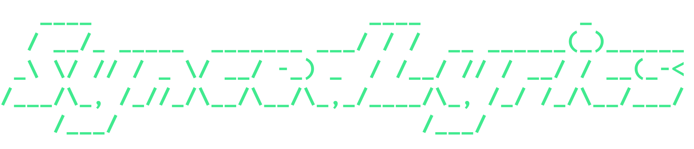

  

SongSync is a lightweight tool to extract word-by-word synced lyrics from YouTube Music. It converts lyrics displayed by the Better Lyrics extension (https://betterlyrics.org/) into Enhanced LRC (ELRC) format for easy copying.

> [!NOTE]
> This extension does not fetch lyrics from an external source. It specifically extracts data that Better Lyrics has already injected into your browser page and converts it into Enhanced LRC (ELRC) format.

## How to load the extension

First, download the project as a .zip file and extract it (or clone the repository).

#### For Google Chrome

1. Open Google Chrome.
2. Navigate to `chrome://extensions/` by typing it into the address bar.
3. Toggle the **Developer mode** switch in the top-right corner to **On**.
4. Click the **Load unpacked** button in the top-left corner.
5. Select the extracted folder of this project (the directory containing the `manifest.json` file).

#### For Mozilla Firefox

1. Open Mozilla Firefox.
2. Navigate to `about:debugging` in the address bar.
3. Click on **This Firefox** in the left-hand sidebar.
4. Click the **Load Temporary Add-on...** button.
5. Select the extracted project's `manifest.json` file or any other file inside the root directory.

> **Note:** Firefox removes temporary extensions automatically when you close or restart the browser. You must reload it using these steps each time you restart the browser.

## How to use the extension

- Open YouTube Music and start playing a track.
- Click on the **Lyrics** tab.
- Wait until Better Lyrics finds and syncs the lyrics.
- Open the SyncedLyrics popup window and copy the lyrics.

> [!IMPORTANT]
> For this extension to successfully extract lyrics, you must wait until the Better Lyrics extension fully syncs. Otherwise, lyrics may be extracted with inaccurate timestamps.

## Permissions

- `activeTab`
- Host permissions for `https://music.youtube.com/*`